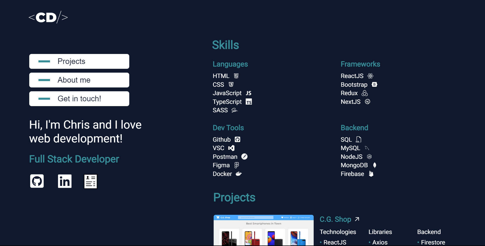
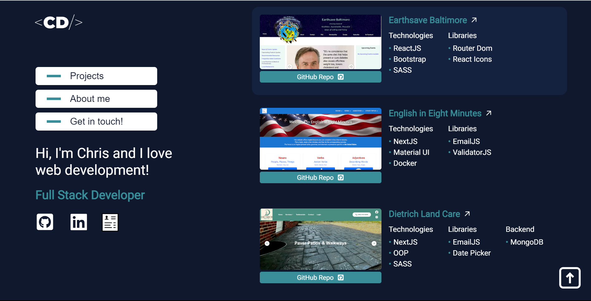
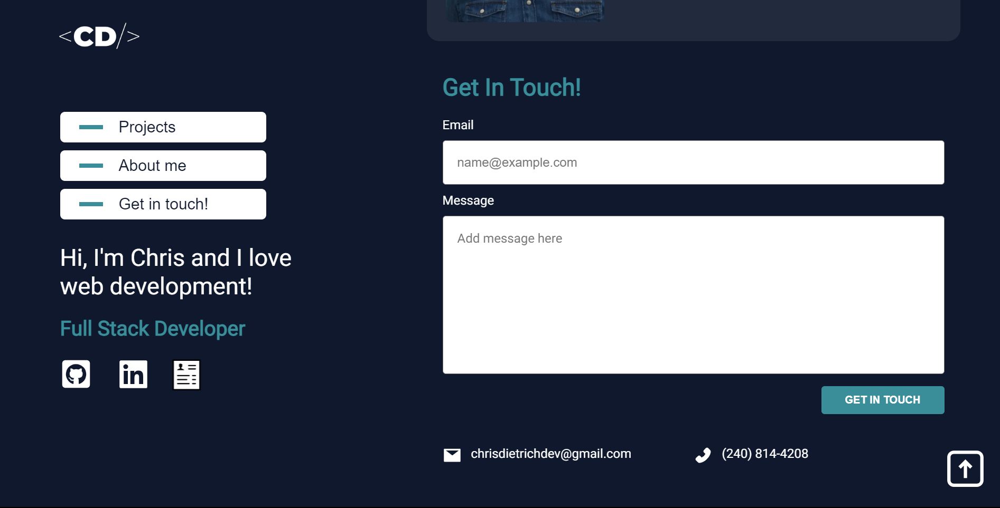

# My Portfolio

This is my updated portfolio website. It was built using NextJS, TypeScript, Context API and MongoDB. For styling I used Material UI and for the contact functionality I used EmailJS. 

## How To Run This Project

1. Clone project (in terminal add `git clone https://github.com/ChrisDietrich405/chris-new-portfolio`)
2. Install dependencies (in terminal run `npm install`)
3. Run project (in terminal run `npm start`)
   Open [http://localhost:3000](http://localhost:3000) to view it in the browser.

## How To Run This Project Using Docker


1. Download and install latest version of Docker https://www.docker.com/get-started/

2. Run `docker compose up` to start the application.

```bash
docker compose up
```

3. Check to see if it worked.
   Open http://localhost:3000 to see if my portfolio is running.


## Screenshots of Landing Page






